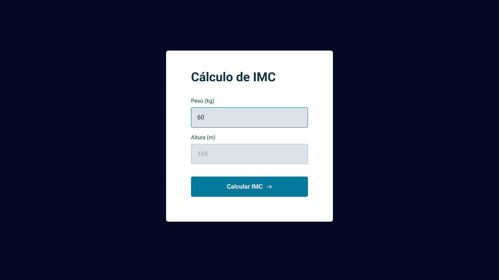

# Cálculo de IMC
Calculadora de IMC feita no curso Explorer da Rocketseat.

## Tecnologias
- HTML
- CSS
- JavaScript
- Git

## Layout
Feito com base [nesse](<https://www.figma.com/file/atKbLPvU3Ell5kKPtzEXPc/IMC/duplicate?type=design&node-id=6-4&mode=design>) layout do Figma.
 

  

